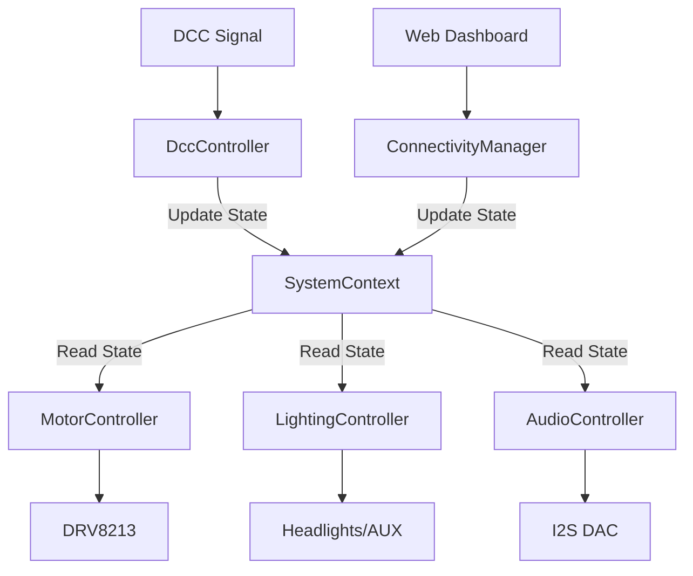

# NIMRS Firmware Architecture

The firmware is designed with a **Modular**, **Event-Driven** architecture to ensure stability and extensibility.

## Core Components

### 1. SystemContext (Singleton)

The "Source of Truth". It holds the current state of the locomotive.

- **State:** Speed, Direction, Function Map (F0-F28), WiFi Status.
- **Access:** `SystemContext::getInstance().getState()`
- **Role:** Decouples Inputs (DCC, WiFi) from Outputs (Motor, Lights).

### 2. ConnectivityManager

Handles all network and high-level system interactions.

- **WiFi:** Manages station connection and Fallback AP (`NIMRS-Decoder`).
- **Web Server:** Serves the Dashboard and API.
- **OTA:** Handles safe A/B firmware updates via `/update`.
- **Logging:** Hosts the live log viewer at `/logs`.

### 3. DccController

The "Input" module.

- **Library:** Wraps `NmraDcc` library.
- **Callbacks:** Receives interrupts for Speed and Function packets.
- **Action:** Updates `SystemContext` state.
- **Persistence:** Intercepts CV writes and commits them to EEPROM.

### 4. MotorController

The "Physics" engine.

- **Input:** Reads target speed/dir from `SystemContext`.
- **Momentum:** Implements CV3 (Accel) and CV4 (Decel) logic.
- **Safety:** Implements "Safe Reversal" (Must stop before flipping direction).
- **Output:** Drives DRV8213 H-Bridge via PWM (20kHz).

### 5. LightingController

Manages visual outputs.

- **Input:** Reads Function states (F0, F1, etc.) from `SystemContext`.
- **Logic:** Handles directional headlights (F0F/F0R).
- **Output:** Drives MOSFETs for AUX outputs.

## Data Flow

